## **Reference Architecture**


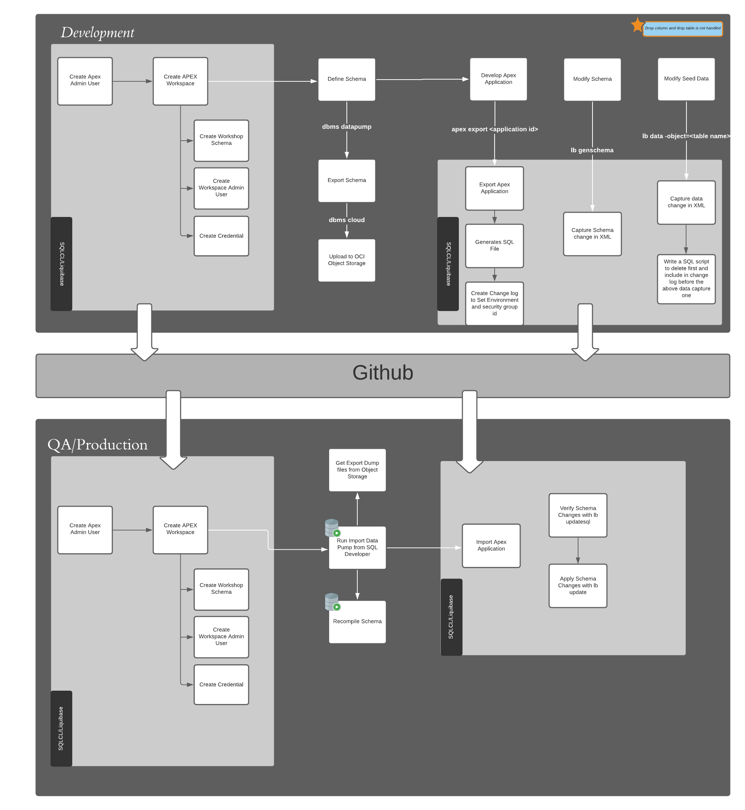

### ***Prerequisites***

1. Download latest JAVA and JDK library from 

```
<copy>
  mkdir ~/java
  cd ~/java
  tar -xf /tmp/<java zipped archive>
  ln -s ./j* ./<jdk version>
</copy>  
```

2. Install SQLCL in your local desktop or in OCI Compute Instance. You can download from 

```
<copy>
cd ~
unzip -oq /tmp/<sqlcl archive>
export JAVA_HOME=${HOME}/java/<jdk version>
alias sql="${HOME}/sqlcl/bin/sql"
</copy>
```

## **Development Environment Setup**:

### ***Prerequisites***

1. Setup Oracle Autonomous Database or APEX Development service from OCI Console.

2. Download Wallet from OCI cloud console into Local Desktop or Compute Instance

### **STEP 1**: **Create APEX Admin User**:

Oracle Autonomous Database has `admin` user by default which has all the special privileges to run as a administrator ,  for the purpose of APEX workspace provisioning and management we will be creating `apexadmin` user. Connect as `admin` user to create `apexadmin` user

    ```
    <copy>
    $ sql /nolog
    SQL>  set cloudconfig  <wallet downloaded directory>/<wallet zip file>
    SQL> conn admin/<password>@<service name>
    SQL> lb update -changelog <admin directory>/changelog_admin.xml
    </copy>
    ```


### **STEP 2**: **Create APEX Workspace** and **Workspace administrator**:

Create `workshop` schema , `WS_WORKSHOP` APEX workspace and `WORKSP_ADMIN` workspace administrator user

```
<copy>
$ sql /nolog
SQL> set cloudconfig  <wallet downloaded directory>/<wallet zip file>
SQL> conn apexdmin/<password>@<service name>
SQL> lb update -changelog <admin directory>/changelog_workshop.xml
</copy>
```

### **STEP 3**: Download  **Opportunity Tracker** productivity application from **Application Gallery** under **Producity Apps**

1. Login as `worksp_admin` created in Step 2.

2. Click on App Gallery and click on Productivity Apps and locate Opportunity track and click to install it

3. Once installed unlock the application so that you can modify it

4. When the Opportunity Tracker application is installed , the associated database tables/views/packages and all associated objects are also installed under `WORKSHOP` schema.

5. Run the application with the `worksp_admin` user and the same workspace password to make sure it is working.

## **STEP 4**: Prepare for moving to QA and Production

1. Move the database schema and data , to move the database objects we will have to export the `WORKSHOP` schema and the data using `dbms_datapump` api
```
<copy>
  $ sql /nolog
  SQL> set cloudconfig  <wallet downloaded directory>/<wallet zip file>
  SQL> conn apexadmin/<password>@<service name>
  SQL> lb update -changelog <admin directory>/export_database.xml
</copy>
```
2. Export files are written into `DATA_PUMP_DIR` by default and in a Autonomous database you can access it by
```
<copy>
  select object_name, bytes
  from dbms_cloud.list_files('DATA_PUMP_DIR') WHERE object_name like '%dmp%`

 </copy>
 ```

### **STEP 5**: Prepare to export apex application
  You can enter the application id of the APEX application when generating

  ```
 <copy>
 $ cd <directory where you want to store the apex file>
 $sql /nolog
 SQL> set cloudconfig  <wallet downloaded directory>/<wallet zip file>
 SQL> conn workshop/<password>@<service name>
 SQL>  lb genobject -type apex -applicationid <application id>
 </copy>
 ```

## **Deployment Environment Setup**:

### ***Prerequisites***

 1. Setup Oracle Autonomous Database or APEX Development service from OCI Console.

 2. Download Wallet from OCI cloud console into Local Desktop or Compute Instance

 3. Create Pre Authenticated URL in OCI Object Storage for the export dump file.

 4. Create a saved connection in SQL developer on your Local machine with the imported wallet.

 ### **STEP 1**: **Create APEX Admin User**:

 Oracle Autonomous Database has `admin` user by default which has all the special privileges to run as a administrator ,  for the purpose of APEX workspace provisioning and management we will be creating `apexadmin` user. Connect as `admin` user to create `apexadmin` user

     ```
     <copy>
     $ sql /nolog
     SQL>  set cloudconfig  <wallet downloaded directory>/<wallet zip file>
     SQL> conn admin/<password>@<service name>
     SQL> lb update -changelog <admin directory>/changelog_admin.xml
     </copy>
     ```


 ### **STEP 2**: **Create APEX Workspace** and **Workspace administrator**:

 Login as `apexadmin` user to Create `workshop` schema , `WS_WORKSHOP` APEX workspace and `WORKSP_ADMIN` workspace administrator user

 ```
 <copy>
 $ sql /nolog
 SQL> set cloudconfig  <wallet downloaded directory>/<wallet zip file>
 SQL> conn apexadmin/<password>@<service name>
 SQL> lb update -changelog <admin directory>/changelog_workshop.xml
 </copy>
 ```

### **STEP 3**: **Import the Database Schema**

Entire Database Schema import for the first time need to be done manually with the dump file exported using the Data Pump Export utility .

The Credential is already created in the **Step 2** with **DEF_CRED_NAME**

You can import the Database schema using the **SQL Developer** *DataPump Import Wizard*

1. Click on View in **SQL Developer** tool bar and select *DBA* option
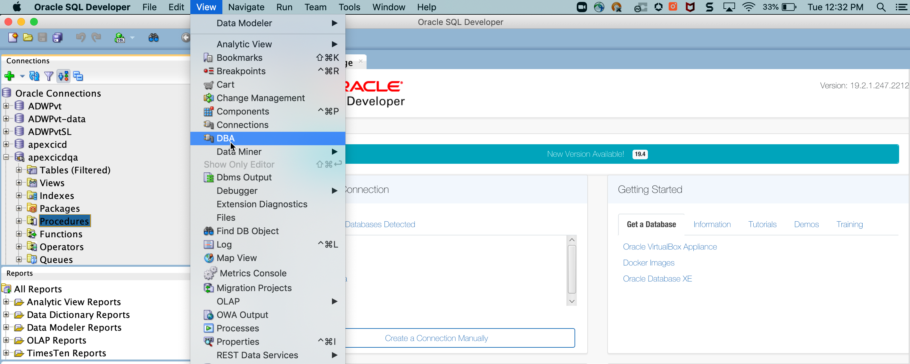

2. *DBA* option opens under the *Connections*
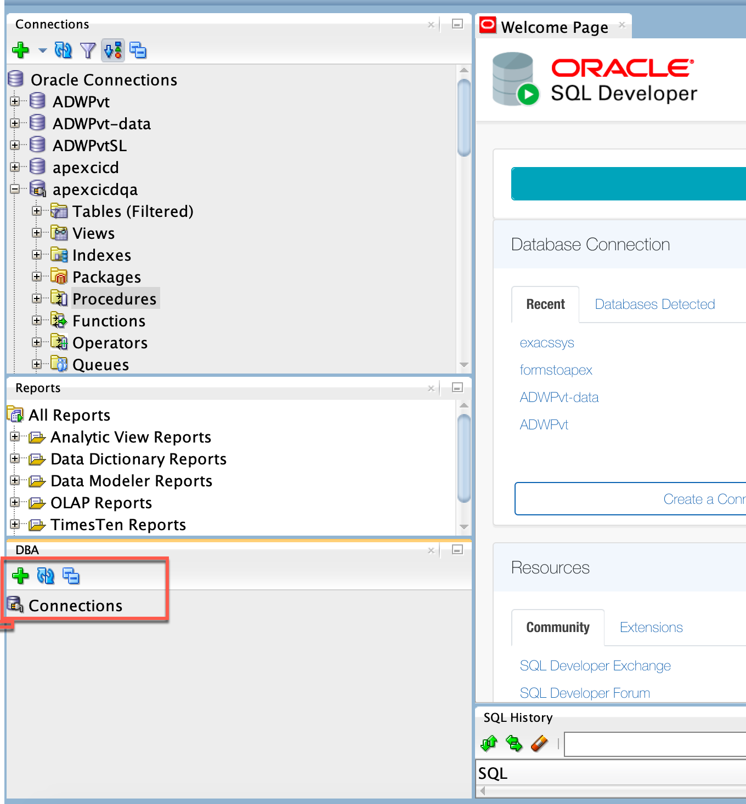

3. Click on **+** sign to connect to the database
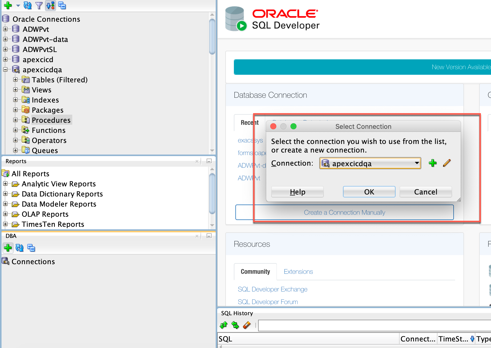

4. Connect to the Deployment database
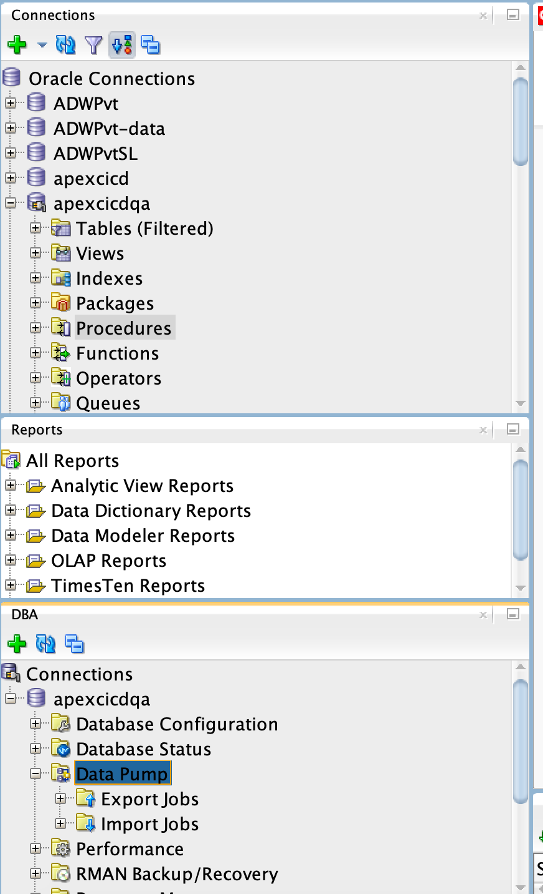

5. Expand the **Data Pump** menu , right click on **Import Jobs** you will see **Data Pump Import Wizard**
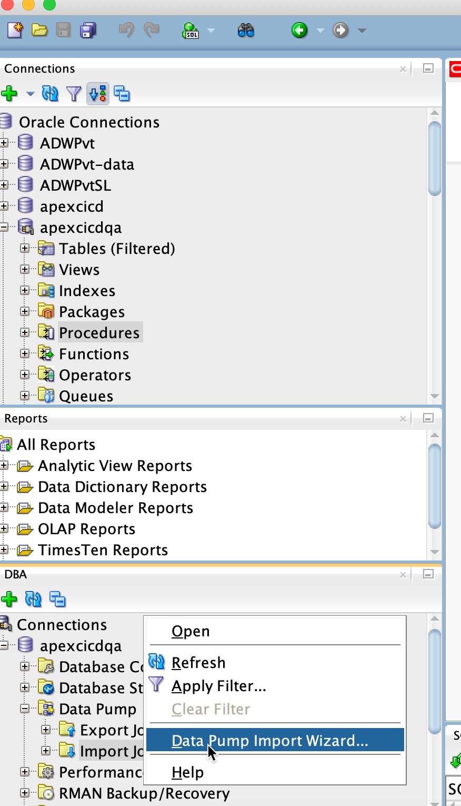

6. Choose **Type of Import** as *Full* and Select the *DEF_CRED_NAME* that was created in *STEP 2* and paste the *Pre Authenticated URL* for the dump file created in *Oracle Object Storage*
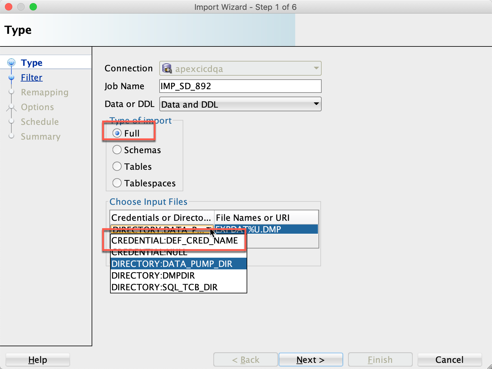
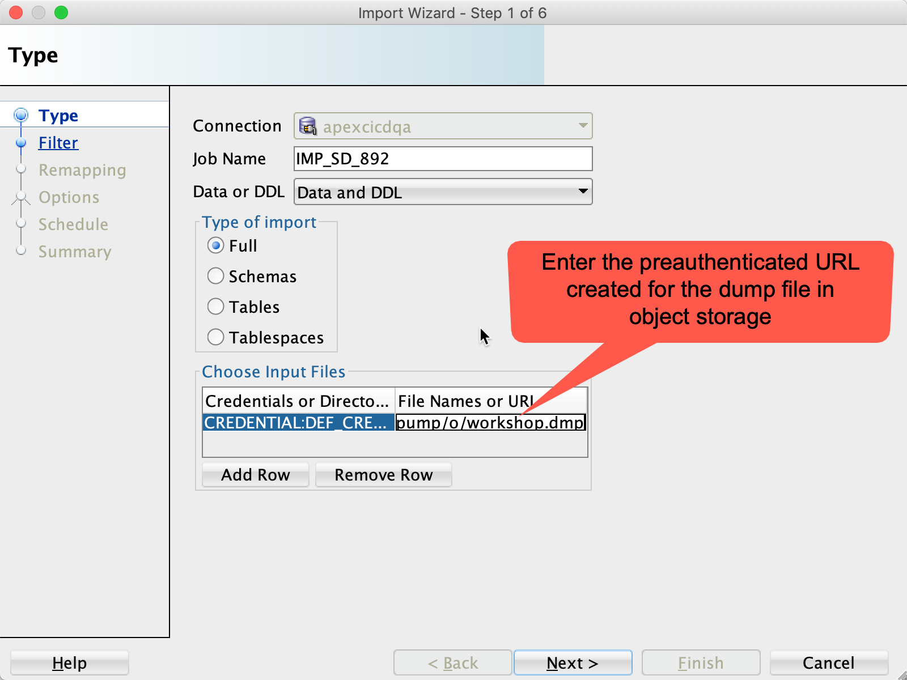

7. Click *Next* on *Filter* and *Remapping* steps leaving the default values
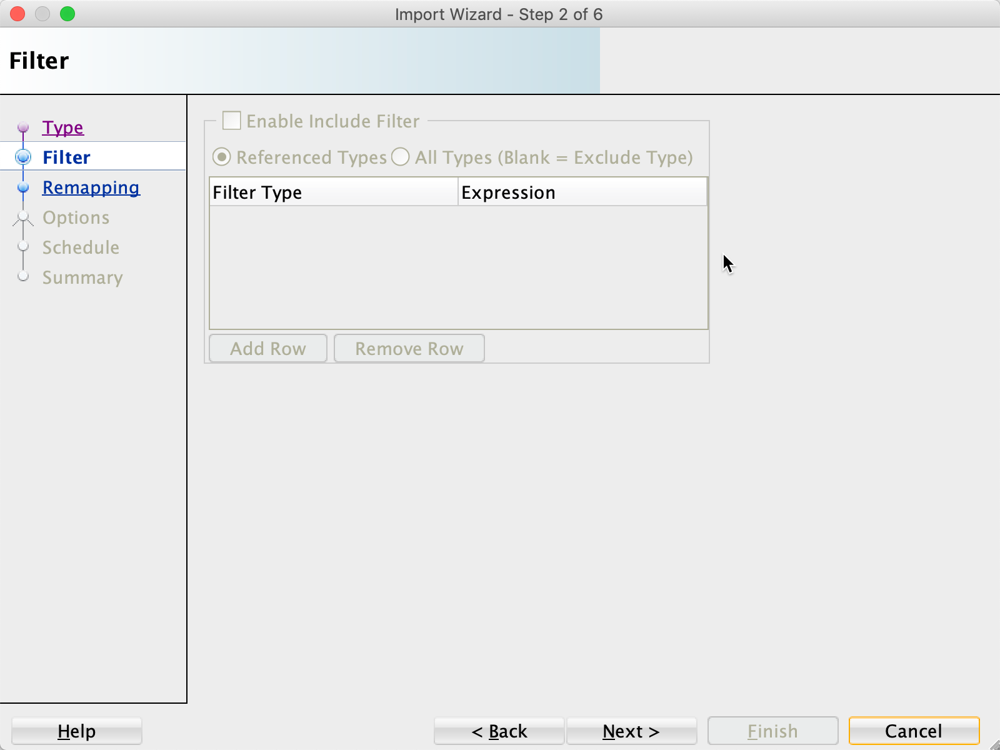
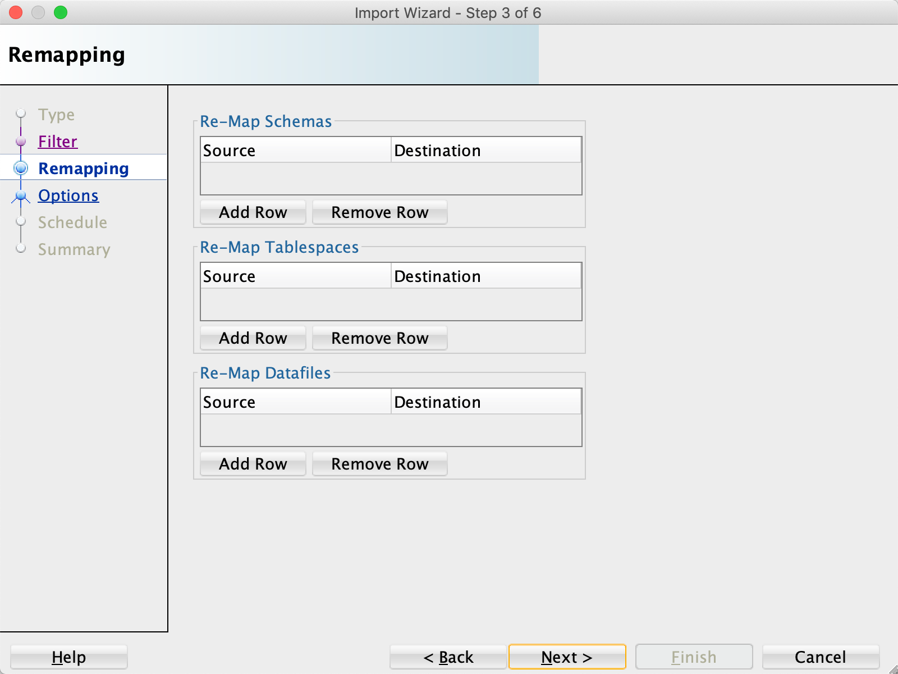

8. Choose the options as highlighted
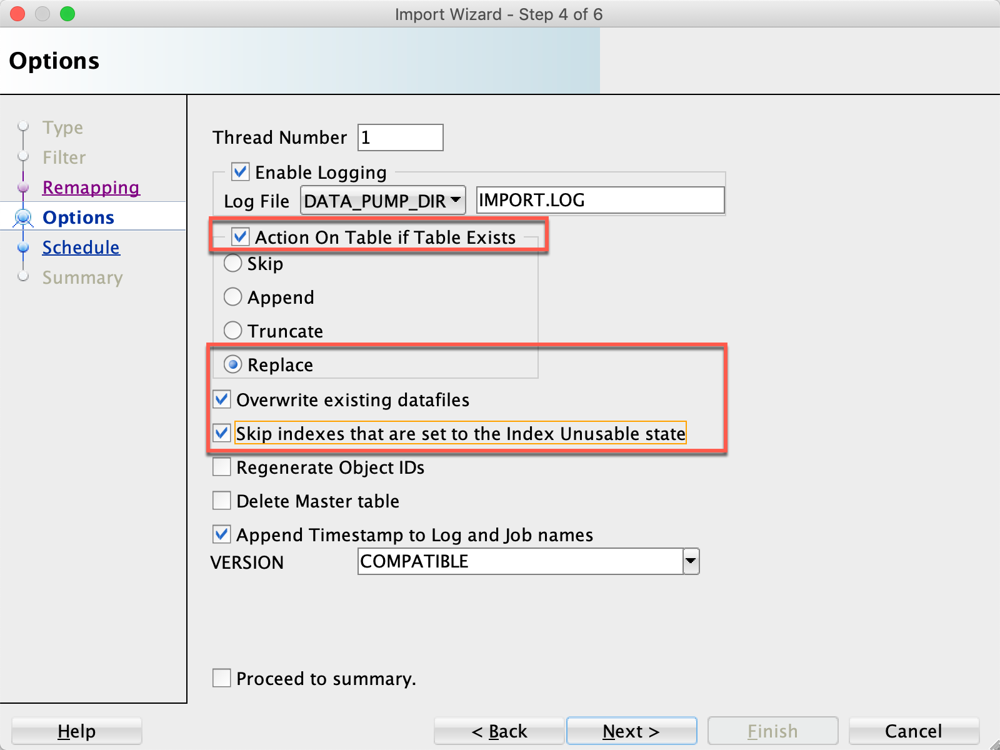

9. Choose the schedule as *Immediate*
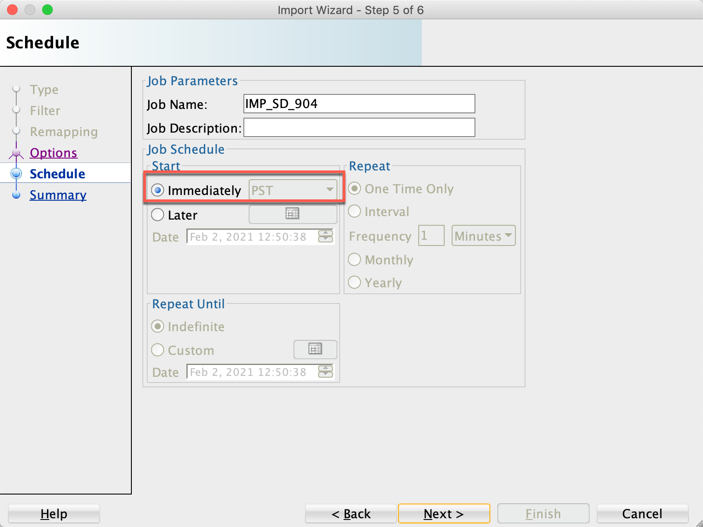

10. Click finish
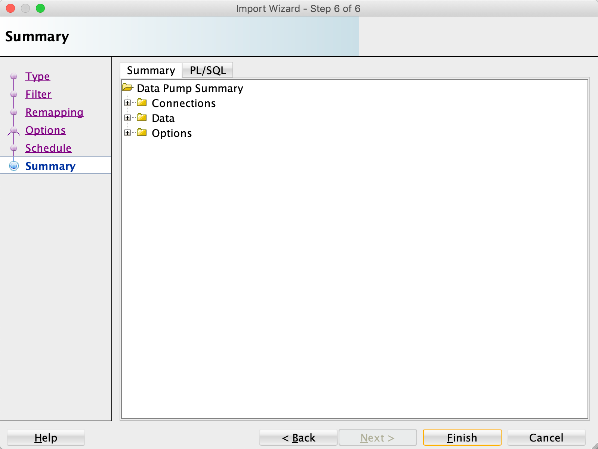

11. When the job completes running successfully you will able to see the log as outlined
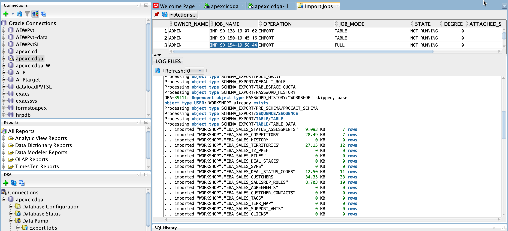


### **STEP 4**: **Deploy the APEX Application**

```
<copy>
$ sql /nolog
SQL> set cloudconfig  <wallet downloaded directory>/<wallet zip file>
SQL> conn admin/<password>@<service name>
SQL> lb update -changelog <deployment directory>/change_create_apex.xml
</copy>
```

## **Sample Scripts**:

## **First time Setup Steps**:


Download latest JAVA and JDK jdk-15.0.2_linux-x64_bin.tar.gz library from https://www.oracle.com/java/technologies/javase-jdk15-downloads.html

Copy from local desktop to Compute instance if you are running in your compute instance

```
scp -i ~/.ssh/sqlcl jdk-15.0.2_linux-x64_bin.tar.gz opc@129.213.145.126:/tmp

ssh -i ~/.ssh/sqlcl opc@129.213.145.126

mkdir ~/java
cd ~/java
tar -xf /tmp/jdk-15.0.2_linux-x64_bin.tar.gz
ln -s ./j* ./jdk-15.0.2

```

Download the SQLCL from https://www.oracle.com/tools/downloads/sqlcl-downloads.html (https://download.oracle.com/otn/java/sqldeveloper/sqlcl-20.4.1.351.1718.zip)


```
scp -i ~/.ssh/sqlcl sqlcl-20.4.1.351.1718.zip opc@129.213.145.126:/tmp

cd ~
unzip -q /tmp/sqlcl-20.4.1.351.1718.zip
export JAVA_HOME=${HOME}/java/
alias sql="${HOME}/sqlcl/bin/sql"

```

Download the ATP Development database Wallet from OCI Console and Copy it to the compute Instance

```
scp -i ~/.ssh/sqlcl Wallet_ApexATPCICD.zip opc@129.213.145.126:/home/opc
```


Download the ATP QA database Wallet from OCI Console and Copy it to the compute Instance

```
scp -i ~/.ssh/sqlcl Wallet_APEXCICDQA.zip opc@129.213.145.126:/home/opc
```

Create the directory structure in compute instance/local desktop

```
  mkdir git
  mkdir git/admin
  mkdir git/admin/changelogs
  mkdir git/admin/scripts
  mkdir git/development/
  mkdir git/development/apex
  mkdir git/development/changelogs
  mkdir git/development/scripts
  cd   /home/opc/git/development/apex
```
Connect to the development database instance

```
sql /nolog
SQL> set cloudconfig /home/opc/Wallet_ApexATPCICD.zip
SQL> conn admin/WELcome##12345@apexatpcicd_high
```

Create the APEX admin user with default password *WELcome##12345*

```
SQL> lb update -changelog /home/opc/git/admin/changelogs/changelog_admin.xml
```

Connect as the APEX admin user to create *WORKSHOP* schema , *APEX Workspace* and Workspace Admin user *WORKSP_ADMIN* user with default password *WELcome##12345*

```
SQL> conn apexadmin/WELcome##12345@apexatpcicd_high
SQL> lb update -changelog /home/opc/git/admin/changelogs/changelog_create_workshop.xml
```

Login to the APEX Workspace as *WORKSP_ADMIN* with  default password *WELcome##12345* , Import the Opportunity Tracker application and Unlock the application


Once Installed unlock the application to make modification


Export the APEX application

```
SQL> apex export 100
```

You will see *f100.sql* created under the directory where the apex export is run from

Export the Database Schema

```
SQL> lb update -changelog /home/opc/git/admin/changelogs/export_database.xml
```

Connect to the QA database instance

```
sql /nolog
SQL> set cloudconfig /home/opc/Wallet_APEXCICDQA.zip
SQL> conn admin/WELcome##12345@apexcicdqa_high
```

Create the APEX admin user

```
SQL> lb update -changelog /home/opc/git/admin/changelogs/changelog_admin.xml
```

Connect as the APEX admin user to create *WORKSHOP* schema , *APEX Workspace* and Workspace Admin user *WORKSP_ADMIN* user

```
SQL> conn apexadmin/WELcome##12345@apexcicdqa_high
SQL> lb update -changelog /home/opc/git/admin/changelogs/changelog_create_workshop.xml
```


Follow the steps in *STEP 3*: *Import the Database Schema*
to import the schema

Connect as Workshop user and import the apex application 

```
SQL> conn workshop/WELcome##12345@apexcicdqa_high
SQL> lb update -changelog /home/opc/git/development/changelogs/change_create_apex.xml
```

### **Steps for Schema Changes to the application **:

```
mkdir /home/opc/git/development/changelogs/v1
cd /home/opc/git/development/changelogs/v1
```

Alter the table EBA sales errors to add new column
```
sql /nolog
SQL> set cloudconfig /home/opc/Wallet_ApexATPCICD.zip
SQL> conn workshop/WELcome##12345@apexatpcicd_high
SQL> ALTER TABLE EBA_SALES_errors add  (APEX_ERROR_DESC VARCHAR2(1000))
```
Add a new table

```
SQL> create table notes ( note_id number, note_desc VARCHAR2(255))
```

Capture the Schema changes

```
SQL> lb genschema
```

Connect to the QA Instance and first run *lb -updatesql* to verify the schema changes and then run *lb -update* to apply the changes

```
sql /nolog
SQL> set cloudconfig /home/opc/Wallet_APEXCICDQA.zip
SQL> conn workshop/WELcome##12345@apexcicdqa_high
SQL> lb -updatesql /home/opc/git/development/changelogs/v1/controller.xml
SQL> lb -update /home/opc/git/development/changelogs/v1/controller.xml

```
### **Steps for Moving data changes to the application **:

Create a new directory v2

```
mkdir /home/opc/git/development/changelogs/v2
cd /home/opc/git/development/changelogs/v2
```

Connect to the development instance and insert data into NOTES table
```
sql /nolog
SQL> set cloudconfig /home/opc/Wallet_APEXCICDQA.zip
SQL> conn workshop/WELcome##12345@apexcicdqa_high
SQL> INSERT INTO NOTES VALUES (1, 'APEX Changes');
SQL> INSERT INTO NOTES VALUES (2, 'APEX Changes 2');
lb data -object NOTES
```
Verify and Deploy the data changes to QA instance

```
sql /nolog
SQL> set cloudconfig /home/opc/Wallet_APEXCICDQA.zip
SQL> conn workshop/WELcome##12345@apexcicdqa_high
SQL> lb -updatesql /home/opc/git/development/changelogs/v2/data.xml
SQL> lb -update /home/opc/git/development/changelogs/v2/data.xml
```

### **Steps for Rollback changes to the application **:

if you want to rollback the changes, write a custom script or use SQLCL rollback command to rollback number of changes or by date

```
lb rollbacksql -changelog controller.xml -count 1
```
